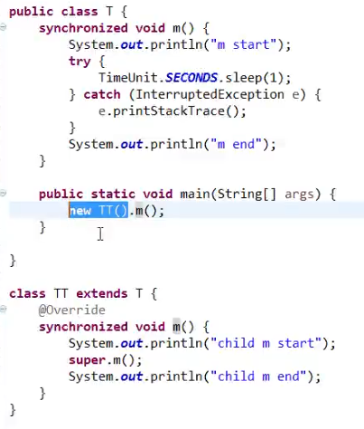
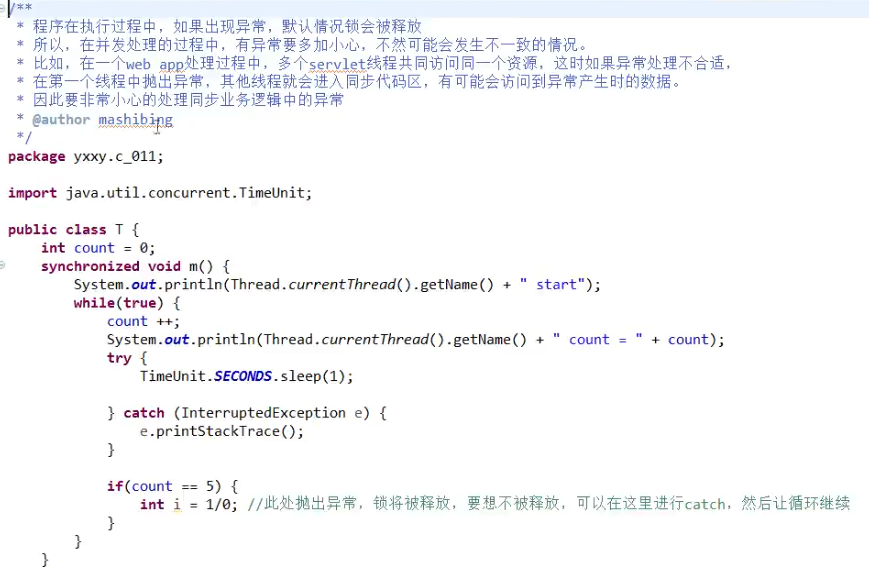
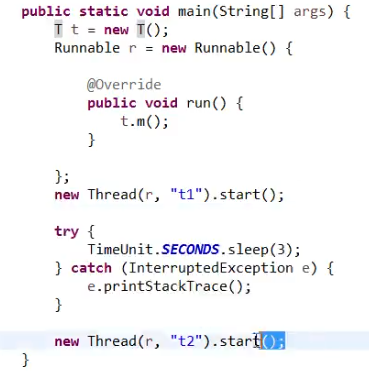
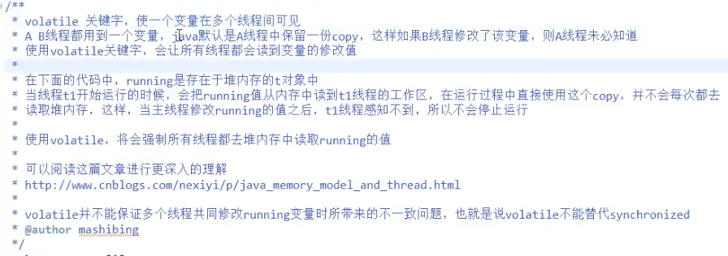
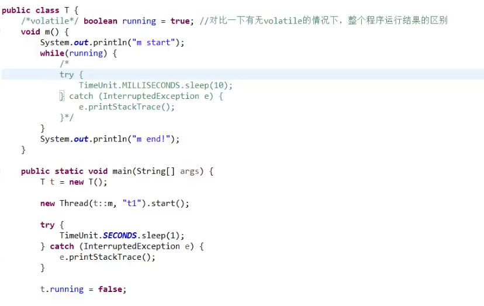

#线程
1. 例子1
 synchronized关键字
 对某个对象进行加锁。
   ```java
        public class T{
            private int count = 10;
            private Object o = new Object();//用于加锁的标志
            public void m(){
              synchronized(o){ //任何线程要执行下面的代码，就要拿到o的锁。
                  count--;
                   sout(Thread..currentThread().getName()+" count = "+count);    
              }
            }
        }
    ```
    o这个变量指向堆内存的的变量。而加锁加的是该引用指向的堆内存的变量。当多个线程想访问时，只有当前方法执行完释放锁，其他线程才能获取资源  
2. 例子2 
    ```java
      public class T{
          private int count = 10;
          public void m(){
            synchronized(this){ //任何线程要执行下面的代码，必须拿到this的锁，synchronized拿到的是对象，不是方法块。
                count--;
                sout(Thread..currentThread().getName()+" count = "+count);    
            }
          }
      }
    ```
3. 例子3，例子2的简化版本写法
   ```java
        public class T{
               private int count = 10;
               public synchronized void m(){ //等同于synchronized(this)，锁定当前对象
                     count--;
                     sout(Thread..currentThread().getName()+" count = "+count);    
                
               }
           }
   ```
4. 例子4  synchronized用于静态方法，锁定的是当前的Class

    ```java
          public class T {
                  private int count = 10;
                  public synchronized static void m(){ //等同于synchronized(xxxx.xxxx.T.class)
                     count--;
                     sout(Thread..currentThread().getName()+" count = "+count);    
                       
                      }
                   public static void m(){
                     synchronized(T.class){
                     count--;
                     }
                  }
    ```
5. 例子5  
  这个会出现什么问题呢，数据有时会产生异常 7 7 7 7 5这种数据会产生
    ```java
          public class T  implements Runnable{
                private int count = 10;
                
                  public /*synchronized*/  void run(){ //等同于synchronized(xxxx.xxxx.T.class)
                     count--;
                     sout(Thread..currentThread().getName()+" count = "+count);    
                      }
                   public static void main(String args[]){
                    T t = new T();
                    for(int i=0;i<5;i++){
                      new Thread(t,"THREAD"+i).start();
                    }
                     }
                  }
    ```
6. synchronized线程和非synchronized线程是否可以同时运行（面试问题）
    ```java
    public class Test {
      public synchronized void m1(){
          System.out.println(Thread.currentThread().getName()+"  m1 start....");
          try{
              Thread.sleep(10000);
    
          }catch (InterruptedException e ){
              e.printStackTrace();
          }
          System.out.println(Thread.currentThread().getName()+" m1 end.......");
      }
      public void m2(){
          try {
              Thread.sleep(5000);
          } catch (InterruptedException e) {
              e.printStackTrace();
          }
          System.out.println(Thread.currentThread().getName()+"  m2.......");
      }
    
        public static void main(String[] args) {
            Test t = new Test();
            new Thread(t::m1,"t1").start();
            new Thread(t::m2,"t2").start();
        }
    }
        执行的结果为
        t1  m1 start....
        t2  m2.......
        t1 m1 end.......
    证明synchronized和非synchronized线程是可以同时运行的。
     t::m2的写法相当于new一个 Runnable 写里面的run方法
     或者是new Thread(()->t.ml1(),"t1")
     new Runnable(){
         public void run(){
         t.m1();
     }
    ```
 7. synchronized方法可以调用另一个synchronized方法（同一个类中的方法）一个线程已经拥有某个对象的锁，再次申请的时候仍然会得到对象的锁，也就是说synchronized获得的锁是可重入的
     ```java
         public class Test {
              public synchronized void m1(){
                  System.out.println(Thread.currentThread().getName()+"  m1 start....");
                  try{
                      Thread.sleep(10000);
                  }catch (InterruptedException e ){
                      e.printStackTrace();
                  }
                  this.m2();
                  System.out.println(Thread.currentThread().getName()+" m1 end.......");
              }
              public synchronized void  m2(){
                  try {
                      Thread.sleep(5000);
                  } catch (InterruptedException e) {
                      e.printStackTrace();
                  }
                  System.out.println(Thread.currentThread().getName()+"  m2.......");
              }
            
                public static void main(String[] args) {
                    Test t = new Test();
                    new Thread(t::m1,"t1").start();
                }
            }
     ```
  8. 子类的synchronized方法调用父类的synchronized方法，同上面一样
    
        
  
  9. 出现异常情况，默认情况锁会释放
      
      
  10. volatile关键字  
  
    
    
   