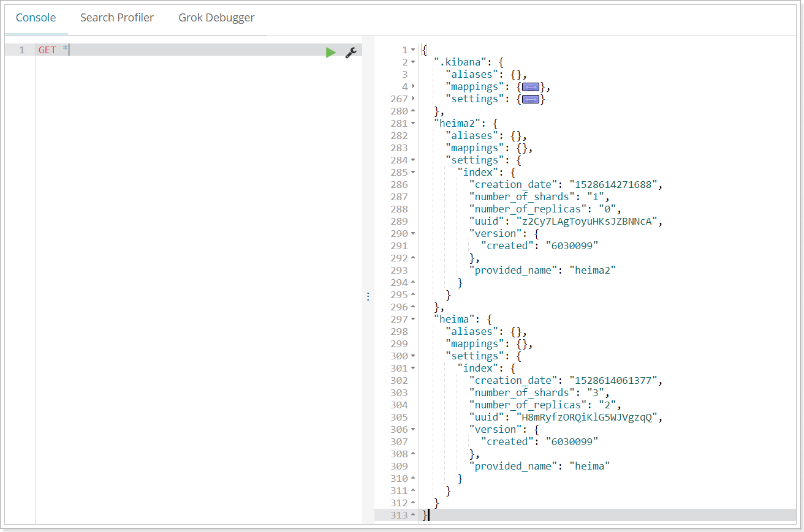

#安装
安装的教程在linux文档中,这里主要时一些elasticsearch的使用和相关工具。
##Kibana
 1. 下载kibana。
 2. 进入安装目录的config中，修改kibnaa.yml 
    ```text
       elasticsearch.url: "http://192.168.19.121:9200"
    ```
 3. 下载分词器ik-analyzer，并上传到elasticsearch的plugins/ik-analyzer中。(注意层级划分，ik-analyzer目录下就是资源，不然就会找不到资源)
 
    
4. 发送请求验证
   ```text
        POST _analyze
        {
          "analyzer": "ik_max_word",
          "text":     "我是中国人"
        }
   ```
   
#基本知识
##操作索引
Elasticsearch也是基于Lucene的全文检索库，本质也是存储数据，很多概念与MySQL类似的。

对比关系：

索引（indices）--------------------------------Databases 数据库

	类型（type）-----------------------------Table 数据表
	
	     文档（Document）----------------Row 行
	
		   字段（Field）-------------------Columns 列 


详细说明：

| 概念                 | 说明                                                         |
| -------------------- | ------------------------------------------------------------ |
| 索引库（indices)     | indices是index的复数，代表许多的索引，                       |
| 类型（type）         | 类型是模拟mysql中的table概念，一个索引库下可以有不同类型的索引，比如商品索引，订单索引，其数据格式不同。不过这会导致索引库混乱，因此未来版本中会移除这个概念 |
| 文档（document）     | 存入索引库原始的数据。比如每一条商品信息，就是一个文档       |
| 字段（field）        | 文档中的属性                                                 |
| 映射配置（mappings） | 字段的数据类型、属性、是否索引、是否存储等特性               |

是不是与Lucene和solr中的概念类似。

另外，在SolrCloud中，有一些集群相关的概念，在Elasticsearch也有类似的：

- 索引集（Indices，index的复数）：逻辑上的完整索引
- 分片（shard）：数据拆分后的各个部分
- 副本（replica）：每个分片的复制


要注意的是：Elasticsearch本身就是分布式的，因此即便你只有一个节点，Elasticsearch默认也会对你的数据进行分片和副本操作，当你向集群添加新数据时，数据也会在新加入的节点中进行平衡。


## 2.2.创建索引

### 2.2.1.语法

Elasticsearch采用Rest风格API，因此其API就是一次http请求，你可以用任何工具发起http请求

创建索引的请求格式：

- 请求方式：PUT

- 请求路径：/索引库名

- 请求参数：json格式：

  ```json
  {
      "settings": {
          "number_of_shards": 3,
          "number_of_replicas": 2
        }
  }
  ```

  - settings：索引库的设置
    - number_of_shards：分片数量
    - number_of_replicas：副本数量
### 2.2.2.测试

我们先用RestClient来试试


响应：


可以看到索引创建成功了。

### 2.2.3.使用kibana创建

kibana的控制台，可以对http请求进行简化，示例：


相当于是省去了elasticsearch的服务器地址

而且还有语法提示，非常舒服。


## 2.3.查看索引设置

> 语法

Get请求可以帮我们查看索引信息，格式：

```
GET /索引库名
```


或者，我们可以使用*来查询所有索引库配置：




## 2.4.删除索引

删除索引使用DELETE请求

> 语法

```
DELETE /索引库名
```

> 示例


再次查看heima2：


当然，我们也可以用HEAD请求，查看索引是否存在：


## 2.5.映射配置

索引有了，接下来肯定是添加数据。但是，在添加数据之前必须定义映射。

什么是映射？

> 映射是定义文档的过程，文档包含哪些字段，这些字段是否保存，是否索引，是否分词等

只有配置清楚，Elasticsearch才会帮我们进行索引库的创建（不一定）


### 2.5.1.创建映射字段

> 语法

请求方式依然是PUT

```
PUT /索引库名/_mapping/类型名称
{
  "properties": {
    "字段名": {
      "type": "类型",
      "index": true，
      "store": true，
      "analyzer": "分词器"
    }
  }
}
```

- 类型名称：就是前面将的type的概念，类似于数据库中的不同表
  字段名：任意填写	，可以指定许多属性，例如：
- type：类型，可以是text、long、short、date、integer、object等
- index：是否索引，默认为true
- store：是否存储，默认为false
- analyzer：分词器，这里的`ik_max_word`即使用ik分词器

> 示例

发起请求：

```json
PUT heima/_mapping/goods
{
  "properties": {
    "title": {
      "type": "text",
      "analyzer": "ik_max_word"
    },
    "images": {
      "type": "keyword",
      "index": "false"
    },
    "price": {
      "type": "float"
    }
  }
}

```

响应结果：

```
{
  "acknowledged": true
}

```


### 2.5.2.查看映射关系

> 语法：

```
GET /索引库名/_mapping
```

> 示例：

```
GET /heima/_mapping
```

> 响应：

```json
{
  "heima": {
    "mappings": {
      "goods": {
        "properties": {
          "images": {
            "type": "keyword",
            "index": false
          },
          "price": {
            "type": "float"
          },
          "title": {
            "type": "text",
            "analyzer": "ik_max_word"
          }
        }
      }
    }
  }
}
```


### 2.5.3.字段属性详解

#### 2.5.3.1.type

Elasticsearch中支持的数据类型非常丰富：


我们说几个关键的：

- String类型，又分两种：

  - text：可分词，不可参与聚合
  - keyword：不可分词，数据会作为完整字段进行匹配，可以参与聚合

- Numerical：数值类型，分两类

  - 基本数据类型：long、interger、short、byte、double、float、half_float
  - 浮点数的高精度类型：scaled_float
    - 需要指定一个精度因子，比如10或100。elasticsearch会把真实值乘以这个因子后存储，取出时再还原。

- Date：日期类型

  elasticsearch可以对日期格式化为字符串存储，但是建议我们存储为毫秒值，存储为long，节省空间。


#### 2.5.3.2.index

index影响字段的索引情况。

- true：字段会被索引，则可以用来进行搜索。默认值就是true
- false：字段不会被索引，不能用来搜索

index的默认值就是true，也就是说你不进行任何配置，所有字段都会被索引。

但是有些字段是我们不希望被索引的，比如商品的图片信息，就需要手动设置index为false。


#### 2.5.3.3.store

是否将数据进行额外存储。

在学习lucene和solr时，我们知道如果一个字段的store设置为false，那么在文档列表中就不会有这个字段的值，用户的搜索结果中不会显示出来。

但是在Elasticsearch中，即便store设置为false，也可以搜索到结果。

原因是Elasticsearch在创建文档索引时，会将文档中的原始数据备份，保存到一个叫做`_source`的属性中。而且我们可以通过过滤`_source`来选择哪些要显示，哪些不显示。

而如果设置store为true，就会在`_source`以外额外存储一份数据，多余，因此一般我们都会将store设置为false，事实上，**store的默认值就是false。**


#### 2.5.3.4.boost

激励因子，这个与lucene中一样

其它的不再一一讲解，用的不多，大家参考官方文档：


## 2.6.新增数据

### 2.6.1.随机生成id

通过POST请求，可以向一个已经存在的索引库中添加数据。

> 语法：

```
POST /索引库名/类型名
{
    "key":"value"
}
```

> 示例：

```json
POST /heima/goods/
{
    "title":"小米手机",
    "images":"http://image.leyou.com/12479122.jpg",
    "price":2699.00
}
```

响应：

```json
{
  "_index": "heima",
  "_type": "goods",
  "_id": "r9c1KGMBIhaxtY5rlRKv",
  "_version": 1,
  "result": "created",
  "_shards": {
    "total": 3,
    "successful": 1,
    "failed": 0
  },
  "_seq_no": 0,
  "_primary_term": 2
}
```


通过kibana查看数据：

```js
get _search
{
    "query":{
        "match_all":{}
    }
}
```


```json
{
  "_index": "heima",
  "_type": "goods",
  "_id": "r9c1KGMBIhaxtY5rlRKv",
  "_version": 1,
  "_score": 1,
  "_source": {
    "title": "小米手机",
    "images": "http://image.leyou.com/12479122.jpg",
    "price": 2699
  }
}
```

- `_source`：源文档信息，所有的数据都在里面。
- `_id`：这条文档的唯一标示，与文档自己的id字段没有关联


