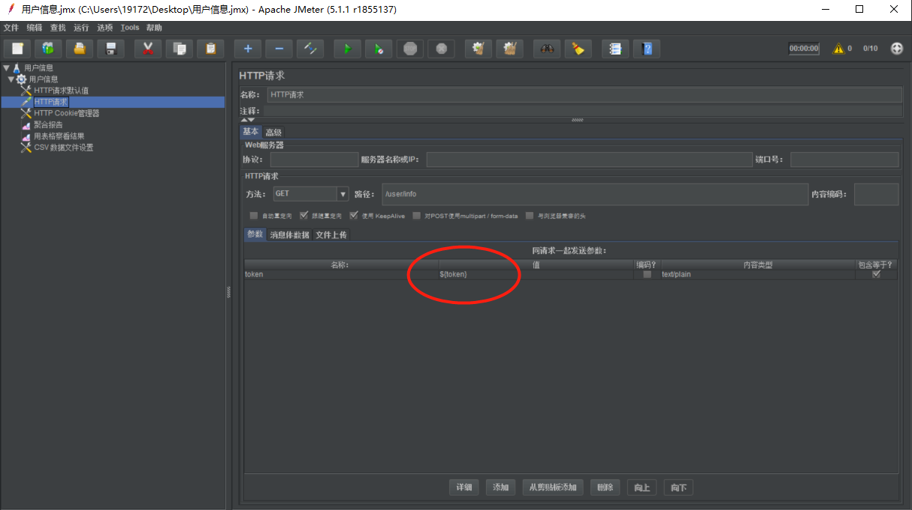

#设计返回类

在一些情况下，我们需要定义一个返回类来对返回的结果进行包装。基本的字段包括 结果码，信息提示和结果数据

```java
package com.wulaohei.miaosha.common;

public class Result <T> {
    private int code;
    private String msg;
    private T data;
    /**
     * 泛型的构造函数
     * @param data
     */
    private Result(T data) {
        this.code = 0;
        this.msg="success";
        this.data = data;
    }

    /**
     * 传入CodeMsg的构造函数
     * @param cm
     */
    private Result(CodeMsg cm) {
        if(cm==null){
            return ;
        }
        this.code = cm.getCode();
        this.msg = cm.getMsg();
    }

    /**
     * 成功时调用
     * @param <T>
     * @return
     */
    public static<T> Result<T> success(T data ){
     return new Result<>(data);
    }

    /**
     * 失败时的调用
     * @param cm
     * @param <T>
     * @return
     */
    public static<T> Result<T> error(CodeMsg cm){
        return new Result<>(cm);
    }
    
    public int getCode() {
        return code;
    }

    public String getMsg() {
        return msg;
    }
    
    public T getData() {
        return data;
    }
    
}

```
```java
package com.wulaohei.miaosha.common;
public class CodeMsg {
    private int code;
    private String msg;
    //通用异常
    public static CodeMsg SUCCESS = new CodeMsg(0, "success");
    public static CodeMsg SERVER_ERROR = new CodeMsg(500100, "服务端异常");
    //登录异常

    //订单模块

    //秒杀模块

    //安全异常
    
    private CodeMsg(int code, String msg) {
        this.code = code;
        this.msg = msg;
    }
    public int getCode() {
        return code;
    }

    public String getMsg() {
        return msg;
    }

}
```
#Redis
##Redis在liunx的安装

##Redis连接池

##Redis用法

###存入redis
* 不带失效时间
* 带失效时间
#Jmeter压测

##使用配置文件进行压测
  使用配置文件，在文件中可以设置多个值给一个变量，循环读取这些值作为变量值发送请求,如配置一个用户的配置文件，读取其中的用户姓名和密码，发送请求。比单一设置固定的参数请求更加符合实际情况。

1、创建配置文件，内容格式类似以下所示,

```json
user1 password1
user2 password2
user3 password3
```
```json
zhuyunsheng  123456
tom  123456
jerry 123456
```
2、jmeter引入


3、测试引入变量



##在linux上进行压测
 1、在windows上将压测文件jmx准备好，并让其上传到linux服务器上。
 
 2、使用命令`nohup java -jar -server -Xmx2048m -Xms2048m  miaosha.jar` 启动自己的jar包

 3、``jmeter.sh -n -t XXX.jmx -l result.jtl `` 进行压测，并将结果保存到result.jtl中。
 
 4、如果自己设置的jmeter的内存太小的话，会产生jmeter异常情况的产生。
 
 5、使用模板数据压测，需要更改jmx中的文件地址。
#页面优化技术
- 页面缓存+URL缓存+对象缓存
- 页面静态化、前后端分离
- 静态资源优化
- cdn优化
##页面缓存和URL缓存（URL缓存在详情页的方法中）
大并发环境下，还要从服务器请求网页数据，占用很大的带宽，而且处理的能力不够。这时候可以将网页模板存储到redis中。
1、取缓存
* 更改跳转的方法，手动修改解析器，首次访问的页面，存入到redis中，缓存页面的保存时间应尽量短。

2、手动渲染模板
```java
 SpringWebContext ctx = new SpringWebContext(request,response,request.getServletContext(),request.getLocale(), model.asMap(), applicationContext );
	//手动渲染
    	html = thymeleafViewResolver.getTemplateEngine().process("goods_list", ctx);
    	if(!StringUtils.isEmpty(html)) {
    		redisService.set(GoodsKey.getGoodsList, "", html);
    	}
    	return html;
```

3、结果输出

##对象缓存
#RabbitMQ
mysql的抗并发能力是比较弱的，最多也就几千个并发，是远远不及ORACLE的。如何对秒杀的接口进行优化
 * 减少数据库的访问   
    * 系统初始化，将商品的库存数量加载到redis中。
    * 收到请求，Redis预减库存，库存不足，直接返回，否则进入3.（过来11个请求，但是库存只有10个，这个时候就进入队列，第11个请求就返回秒杀失败）
    * 请求入队，立即返回派对中。
    * 请求出队，生成订单，减少库存。
    * 客户端轮询，是否秒杀成功。
##linux安装RabbitMQ
下去官网去下载erlang和RabbitMQ的源码文件，上传到服务器。
###安装erlang作为运行环境
```shell
yum install  ncurses-devel

tar xf otp_src_20.1.tar.gz（这个是下载的erlang的源码文件包）

cd otp_src_20.1

./configure --prefix=/usr/local/erlang20 --without-javac --with-ssl

 make
 
 make install
 
 验证是否安装成功
```
###安装RabbitMQ
* 安装python
``yum install python -y``
* 安装simplejson `yum install xmlto yum install python-simplejson`
* 解压源码并进行移动 ``tar xf rabbitmq-server-generic-unix-3.6.14.tar && mv rabbitmq_server-3.6.14 /usr/local/rabbitmq``
* 启动RabbitMQ `./rabbitmq-server`
* 停止RabbitMQ `./rabbitmqctl stop`
* 产看RabbitMQ的运行状态：`netsata -nap | grep 5672`
* 配置环境变量，在任何地方都可以启动
```text
修改环境变量：/etc/profile:
export PATH=$PATH:/usr/local/ruby/bin:/usr/local/erlang20/bin:/usr/local/rabbitmq/sbin
source /etc/profile
./rabbitmq-server启动rabbitMQ server 5672端口监听
rabbitmqctl stop 停止
```
## 添加maven depenency
```text
<dependency>  
<groupId>org.springframework.boot</groupId>  
<artifactId>spring-boot-starter-amqp</artifactId>  
</dependency> 
```
## 添加配置
```properties
spring.rabbitmq.host=10.110.3.62
spring.rabbitmq.port=5672
spring.rabbitmq.username=guest
spring.rabbitmq.password=guest
spring.rabbitmq.virtual-host=/
#消费者数量
spring.rabbitmq.listener.simple.concurrency= 10
spring.rabbitmq.listener.simple.max-concurrency= 10
#消费者每次从队列获取的消息数量
spring.rabbitmq.listener.simple.prefetch= 1
#消费者自动启动
spring.rabbitmq.listener.simple.auto-startup=true
#消费失败，自动重新入队
spring.rabbitmq.listener.simple.default-requeue-rejected= true
#启用发送重试
spring.rabbitmq.template.retry.enabled=true 
spring.rabbitmq.template.retry.initial-interval=1000 
spring.rabbitmq.template.retry.max-attempts=3
spring.rabbitmq.template.retry.max-interval=10000
spring.rabbitmq.template.retry.multiplier=1.0
```
##创建发送者
##创建消费者
##四种交换机（交换方式）